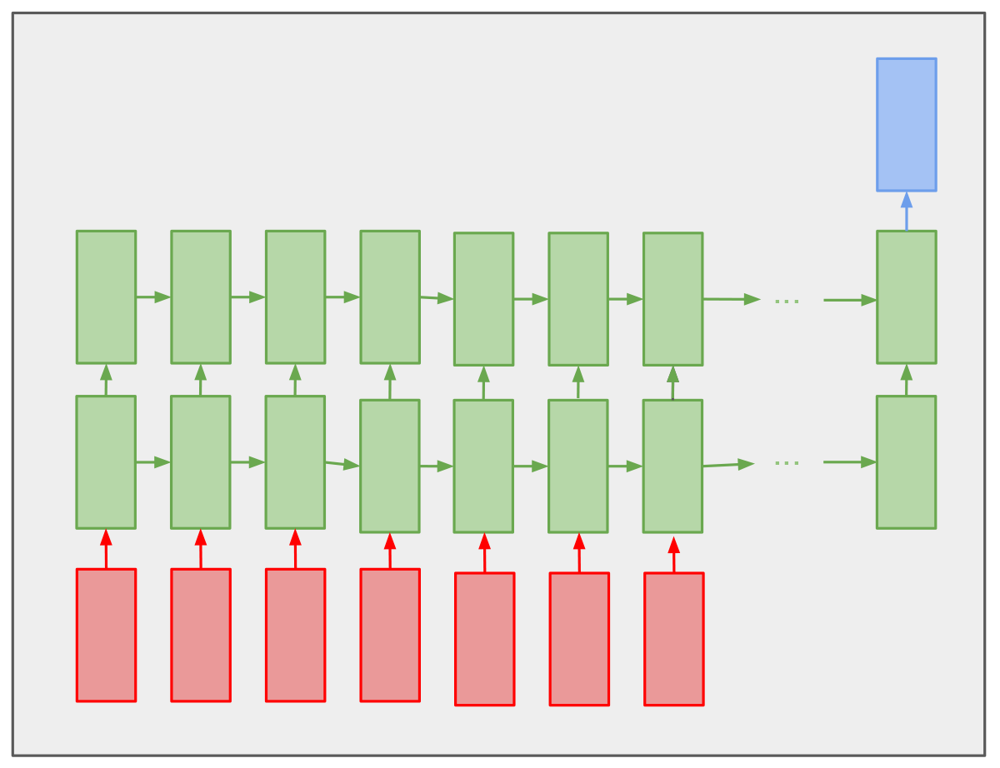

# LSTM

<br>

This folder holds example jupyter scripts for the Encoder-LSTM-Decoder network. Also, you can use the python scripts to train your own LSTM model oder improve the existing approach.

## Predicter VAE-LSTM Many-2-One
Predicts an 8th sequence based on 7 input sequences of a MIDI file




## Predciter VAE-LSTM Many-2-Many
Predicts the next 4 sequences based on 4 input sequences of a MIDI file


## Examples
To use the examples please activate virtual environment and start jupyter notebook from root of this project by:
```bash
jupyter notebook
```
Then navigate to this folder and open Predicter_VAE_LSTM_Many2One or Predicter_VAE_LSTM_Many2One notebook for the corresponding model. Note that you need a song in MIDI format to feed to the network.


<!-- # Train your own!
## Preprocessing of MIDI files
### 1. Transpose MIDI files
If you have not done this for the autoencoder already, transpose your MIDI files to as many pitches as you would like to play in (max. 60 ~ 5 octaves). (File is in Preprocessors)
```bash
python Transposer.py --file_path path/to/dir --tp_by 30 --tp_step_size 1
```
You will end up with lots of midi files which TpBy** endings, which stands for transposed by.

### 2. Cut MIDI files
Make a copy of your transposed MIDI file folder and now cut them all to the same length.
```bash
python MIDI_file_equalizer.py --file_path path/to/dir
```

### 3. Train and save LSTM model
Go to the LSTM folder and train and save your model with your MIDI files.
```bash
python VAE_LSTM_Many2Many.M
```
or
```bash
python VAE_LSTM_Many2One.py
```-->
