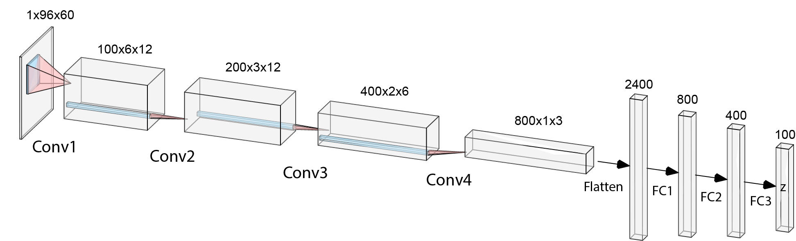

# Undercomplete / Denoising Autoencoder



This encoder architecture is based on [Bretan et al. (2017)](https://arxiv.org/abs/1706.04486) and serves as an undercomplete or denoising autoencoder. The decoder consists of the inverse mapping of this encoder.

## Examples
To use the examples please activate virtual environment and start jupyter notebook from root of this project by:
```bash
jupyter notebook
```
Then navigate to this folder and open DAE notebook. Note that you need a song in MIDI format to feed to the network. I have recorded a short MIDI files to use for proof of concept, they are located one above in [midi_files](https://github.com/Roboy/tss18-robotsinmusicalimprovisation/tree/master/utils/midi_files).

## Train your own
Check VAE folder it works likewise.
