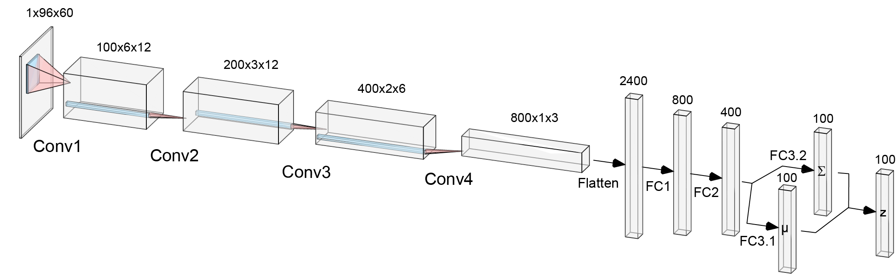

# Variational Autoencoder (VAE)

<br>

The architecture of the encoder of this VAE was adapted from the approach for a denoising autoencoder by [Bretan et al. (2017)](https://arxiv.org/abs/1706.04486). The decoder consists of the inverse mapping without reparametrization.


## Examples
To use the examples please activate virtual environment and start jupyter notebook from root of this project by:
```bash
jupyter notebook
```
Then navigate to this folder and open VAE_Examples notebook. Note that you need a song in MIDI format to feed to the network. I have recorded short MIDI files to use, they are located in the utils folder [midi_files](https://github.com/Roboy/tss18-robotsinmusicalimprovisation/tree/master/utils/midi_files).


## Train your own!
### Preprocess MIDI files

1. **Download a MIDI dataset of your choice** and collect all files in one folder.

2. **Transpose all files in this folder using the Transposer.py in Preprocessors folder.** If you want to transpose your MIDI files to all possible pitches (recommended), try:
```bash
python Transposer.py --file_path /path/to/files --tp_by 60 --tp_step_size 1
```

3. **Cut MIDI files using MIDI_file_cutter.py.** MIDI file cutter will create a new folder sequences in your MIDI data folder which you can use for training.
```bash
python MIDI_file_cutter.py --file_path /path/to/transposed/files
```

4. **Create validation with different dataset.** Works as depicted in 2. and 3., but for validation you don't necessarily need as many files. So you can use a higher tp_step_size in step 2.

4. Train the VAE with your created MIDI files
```bash
python VAE_Train.py --file_path /path/to/transposed/files/sequences --validation_path /path/to/valid/files --model_name my_model_123
```

5. Track your progress with tensorboard by running:
```bash
tensorboard --logdir=/path/to/vae/folder
```
