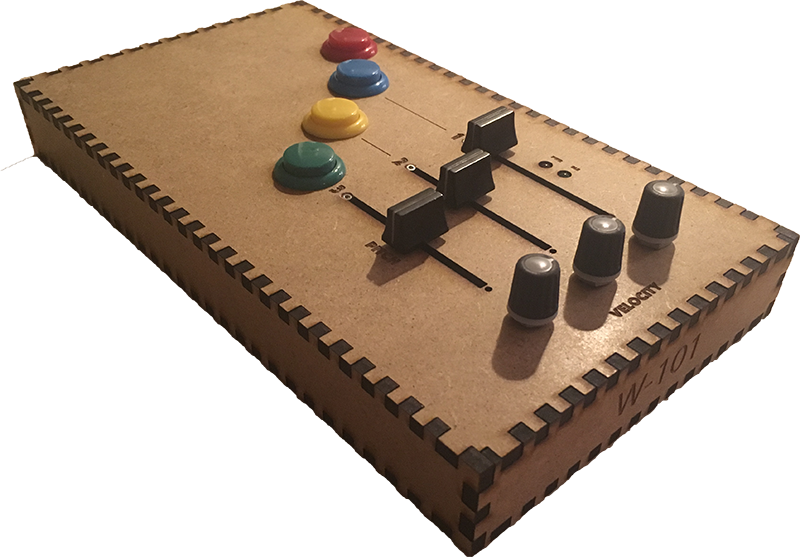

# MIDI Controller

## W-101

## DIY
How to build your own W-101:

1. Mill or order PCB using gerber files located in ./pcb/gerber or send an email to <niclaswesemann@gmail.com> to get a preassembled PCB.

2. (OPTIONAL) Order components to assemble PCB as shown in ./pcb/midi_controller_pcb_component_list.csv

3. Order all components on Mouser. Link to [Shopping Cart](https://eu.mouser.com/ProjectManager/ProjectDetail.aspx?AccessID=26290a0530)

4. Order arcade buttons on Amazon. Link to [Aracde Buttons on Amazon](https://www.amazon.de/XCSOURCE%C2%AE-12x24mm-Bundles-Farbtasten-AC803-Gelb/dp/B071WP4ZW4/)

5. Order a Li-Polymer battery to power the Adafruit Feather 32u4 for example [this one](https://www.amazon.de/Lipo-Akku-Wiederaufladbare-Mini-Akku-808-mate808-18-Schl%C3%BCsselanh%C3%A4nger/dp/B01M3TP2X6/). Note that any similar battery will work. There may be cheaper or better options.

6. Wait for all deliveries :D

7. (OPTIONAL) Assemble PCB using the ordered components. All components except the buttons and on/off switch are placed on the PC.

8. Laser cut the case using ./ble_midi_controller_case.ai

9. Mount the assembled PCB to the case and add buttons by soldering wires to the designated places on the PCB.

10. Flash Feather with code ./bluetooth_midi_controller/bluetooth_midi_controller.ino using Arduino IDE.

11. Hot glue the case except for the top to finish assembly.
